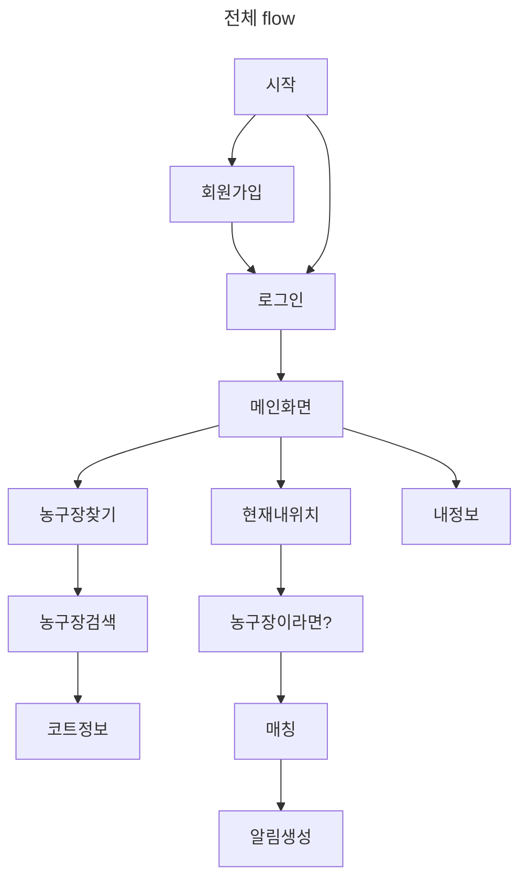
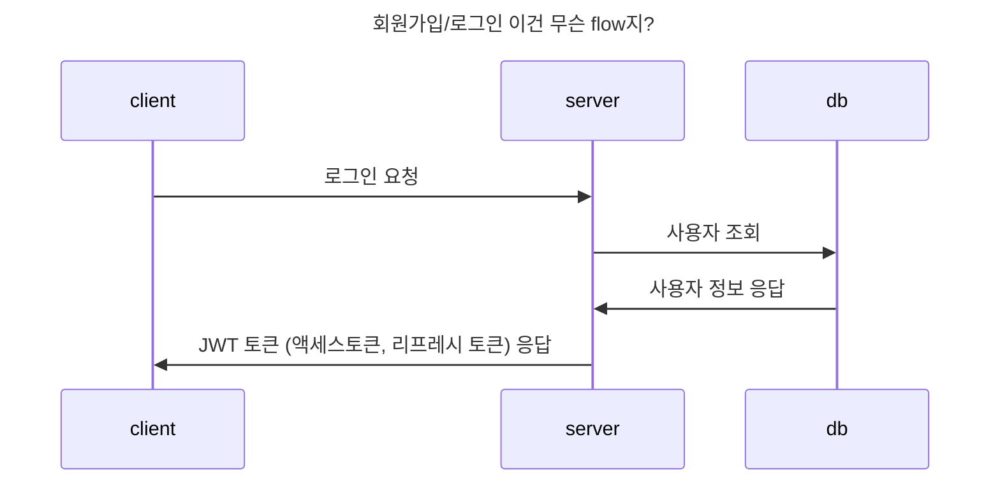
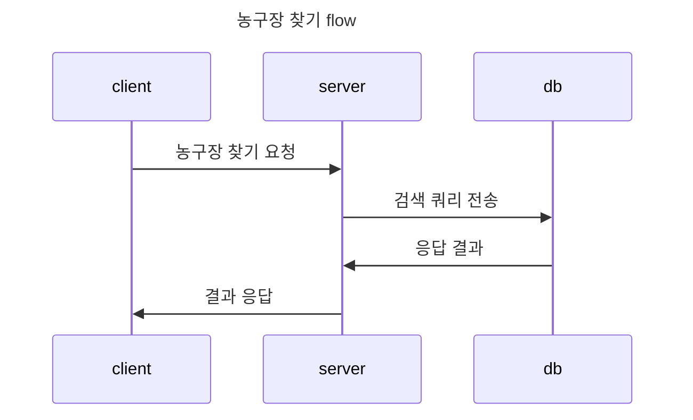
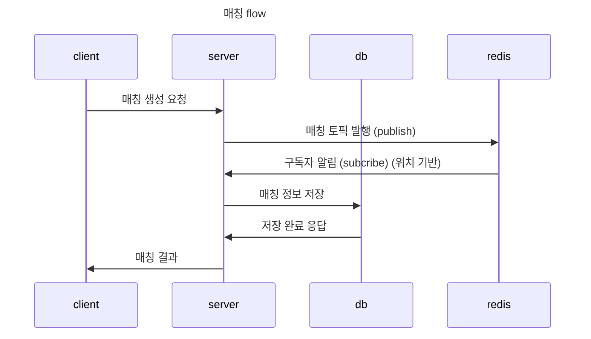

# 전체 flow

```mermaid
---
title : 전체 flow
---
flowchart TD
	시작-->회원가입
	회원가입-->로그인
	시작-->로그인
	로그인-->메인화면
	
	메인화면-->농구장찾기
	농구장찾기-->농구장검색
	농구장검색-->코트정보
	
	메인화면-->현재내위치
  현재내위치-->농구장이라면?
  농구장이라면?-->매칭
	매칭-->알림생성
	
	메인화면-->내정보
```

# 회원가입 / 로그인

```mermaid
---
title : 회원가입/로그인 이건 무슨 flow지?
---
sequenceDiagram
	participant client
	participant server
	participant db
	client->>server: 로그인 요청
	server->>db: 사용자 조회
	db->>server: 사용자 정보 응답
	server->>client: JWT 토큰 (액세스토큰, 리프레시 토큰) 응답
```

# 농구장 찾기

```mermaid
---
title : 농구장 찾기 flow
---
sequenceDiagram
	participant client
	participant server
	participant db
	client->>server: 농구장 찾기 요청
	server->>db: 검색 쿼리 전송
	db->>server: 응답 결과
	server->>client: 결과 응답
```

# 매칭 / 알림

```mermaid
---
title : 매칭 flow
---
sequenceDiagram
	participant client
	participant server
	participant db
	participant redis
	client->>server: 매칭 생성 요청
	server->>redis: 매칭 토픽 발행 (publish)
	redis->>server: 구독자 알림 (subcribe) (위치 기반)
	server->>db: 매칭 정보 저장
	db->>server: 저장 완료 응답
	server->>client: 매칭 결과
```
